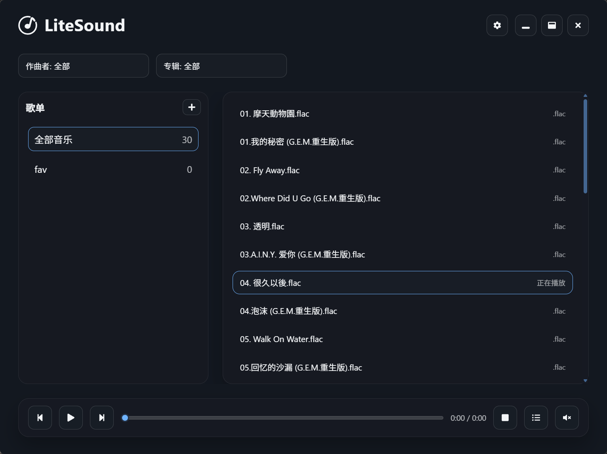
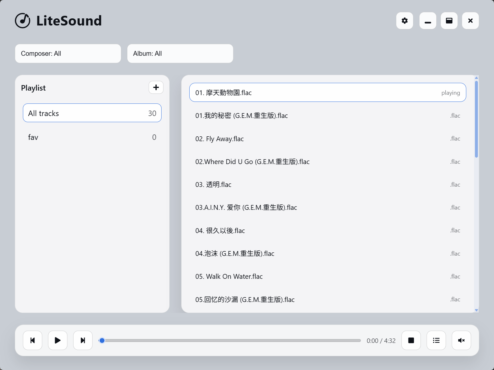
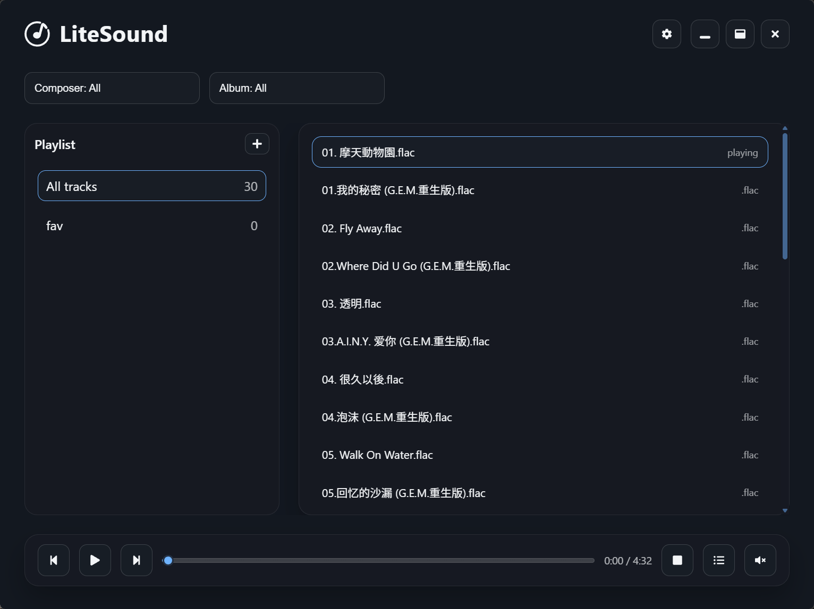

# 🎵 LiteSound

> A **lightweight**, **fast**, and **modern** desktop music player built with [Wails](https://wails.io/) — native feel, no Electron bloat.

<p align="center">
  
</p>

## 🎨 Themes

LiteSound supports light, dark, and system themes for a comfortable listening experience.

|                                     Light Theme                                      |                                     Dark Theme                                     |
| :----------------------------------------------------------------------------------: | :--------------------------------------------------------------------------------: |
|  |  |

---

## ✨ Features

- ⚡ **Lightweight & Fast** — Wails + native webview, quick startup.
- 🎵 **Local Library** — scan your system Music folder (or custom folders).
- 🎧 **Playback Modes** — order, repeat one, shuffle.
- 🧩 **Playlists** — create and manage your own lists.
- 🎚️ **System Volume** — adjust volume with live sync.
- 🌓 **Light / Dark / System** — seamless theme switching.
- 🪟 **Custom Tray Menu** — quick control from the system tray.

---

## ❓ Why make it?

1. I wanted a clean, native-feeling player without Electron overhead.
2. Many existing players are heavy, over-designed, or lack modern UI polish.
3. Building LiteSound helps me sharpen my skills and create a tool I actually use.

---

## 📦 Installation

### 📥 Prebuilt binaries

Check the [Releases](https://github.com/ptsfdtz/litesound/releases) page to download the latest version for Windows.

### 🛠️ Build from source

```bash
# Clone
git clone https://github.com/ptsfdtz/LiteSound.git
cd LiteSound

# Install dependencies
pnpm install

# Run in dev mode
wails dev

# Build production
wails build
```

---

## 🧰 Tech Stack

| Layer           | Technology                 |
| --------------- | -------------------------- |
| Desktop Runtime | [Wails](https://wails.io/) |
| Frontend        | React + TypeScript         |
| Styling         | CSS Modules                |
| Audio           | Howler.js                  |
| Backend         | Go                         |

---

## 👤 Author

**Haoran Tong (ptsfdtz)**

- 💻 [GitHub @ptsfdtz](https://github.com/ptsfdtz)
- ❤️ Building minimal, fast, and beautiful desktop tools.

---

⭐ **Star this repo if you love clean music tools!**

welcome contributions and feedback.
Feel free to open issues or PRs on GitHub.
Happy listening! 🎶
